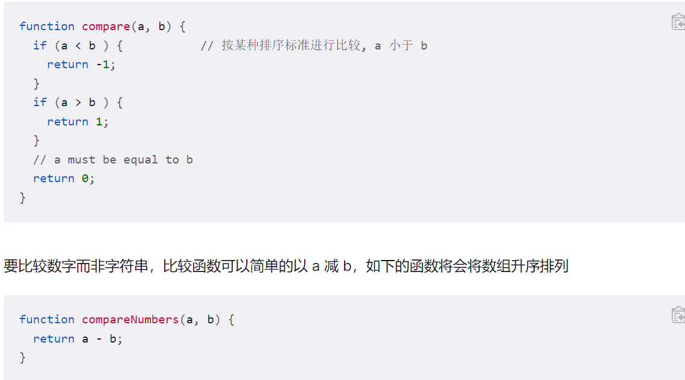
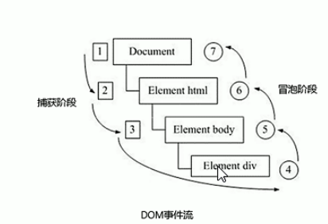

# css 学习之路 [:mag:](index.html)

<details> 
<summary>目录</summary>
   <details>
   <summary>基础</summary>

- [编程语言](#语言分类)
- [javaScript](#javascript-简介)
- [数据类型](#数据类型)
- [运算符](#运算符)
- [流程控制](#流程控制)
- [数组](#数组)
- [函数](#函数)
- [作用域](#作用域)
- [作用域](#作用域)
- [预解析](#预解析)
- [对象](#对象)
- [内置对象](#内置对象)
   </details>
       <details>
      <summary>Web APIs</summary>
* [DOM](#dom)
* [BOM](#bom)
      </details>
</details>

## javascript 基础

### 语言分类

语言可以分为**机器语言**、**汇编语言**和**高级语言**

- 机器语言就是计算机二进制语言

* 汇编语言实质和计算机语言一样，都是直接对硬件进行操作
* 高级语言即程序代码

### javascript 简介

1. JavaScript 是运行在**客户端的脚本语言**，不需要编译，由 js 解释器进行**逐行**解释和执行但是也可通过*node.js*在服务器端执行

\*[逐行]:当报错时，后面的程序就不会在执行

2. 浏览器分为两部分：渲染引擎和 js 引擎

1. 渲染引擎就是浏览器的内核，html+css，如 chrome 的 blink
1. js 引擎是 js 解释器，将 js 语言:arrow_right:机器语言，如 chrome 的 v8 引擎
1. compose of js
   1. ecmascript：JavaScript+Jscript，定义了 JavaScript 的基本语法
   1. API(application programming interface)：Dom+boom
      1. DOM(document object model):oriented mark language,define mechanism of operating mark-up language by standard interface
      1. BOM(Browser object model):interface with browser window document-independently, such as pop box
1. input and output of js
   input:`prompt(info)` import a string
   output:`alert('msg')` for browser and `console.log('msg')` for console
1. variable in special circumstances
   1. no declaration & no assignment:report an error
   2. no assign: report undefined message
   3. no declaration: normal operation but not recommand

### 数据类型

!!!note data type in javascript is weak and dynamic
weak:not define type of data,we can only know it in code running
dynamic:the type of data is not fixed but changed

1. sample type:
   1. number:
      - octal:begin with 0, 010 is 8
      - hexadecimal:begin with 0x, 0xa is 10
      - max(min) value:number.max(min)\_value
      - infinity:beyond the realm of number,number.max_value\*2
      - NaN:not a number,'a' - 1
   2. string:all subject in single quote(recommend) or two quote
      - tranferred meaning:\,'\n=newline' '\t=tab'
      - length: var.length, blank and hanzi is a length
      - link:+,'12'+ 12 = '1212'
      - **'string' + anything = 'string'**
   3. boolean:true=1 & false=0
   4. undifined:undifined + 'string' = undifinedstring <br> undifined + num = NaN
   5. null: null + 'string'= nullstring <br> null+num=num
1. transform of data type
   1. :arrow_right:**string**
      1. `tostring()`: var.tostring() 1.` string()`:string(var)
      1. `+`(implicat): var+ ' '
   2. :arrow_right:**number**
      1. parseInt and parseFloat: extract int and float parseint('12px1')=12 parseint('r1')=NaN
      2. number() and - / \*
   3. :arrow_right:boolean:Boolean(),**false:0 '' NaN undefined null**

### 运算符

1. 算数运算符：%用作取余，浮点数会有转换为二进制时会有精度问题，一般不要运算
2. 递增(减)运算符++：**只能用于变量**
   前置运算符：++var 先自加 1 后返回值，var=10, ++var+10=21
   后置运算符：var++先返回值后自加 1, var=10, var++ + 10=20,var=11
   var = 10,var++ + ++ var=10+11+1=22
3. 比较运算符
   =: 赋值符号
   \==和\!= :全等号会转型，3=='3',返回 true
   \===和\!\== ：要求类型也要相等
4. 逻辑运算符
   `&&:and` `||:or` `!:not`
   - 逻辑短路&&：&&中左右表达式，如果左边是真则返回右边，若是否(0''NaN null undefined)则返回左边的原值，不是布尔值
   - 逻辑短路||:与&&相反，**短路了就不会再运行了**，var num=0<122 || num++ ,num 的值还是 0
5. 赋值运算符
   - num += 2 :arrow_right:num = num + 2
   - num _= 2 :arrow_right:num = num _ 2
6. 优先级
   

### 流程控制

流程控制就是控制代码的执行顺序来实现功能，包括顺序结构、分支结构和循环结构

- 顺序结构：按照代码的先后顺序依次执行
- 分支结构：根据不同的条件进行执行不同的代码，即条件判断执行

  1.  if 分支：`if(条件表达式){条件成立语句}` `if else` `if(){} else if(){}`
  2.  三元表达式：`表达式 ? 表达式1 : 表达式2`相当于 ifelse,结果最好赋值变量
  3.  switch 分支：

  ```javascript
  switch(表达式){
     case value1:执行语句;break
     case value2:执行语句;break
     ...
     default:执行语句;
  }
  ```

  !!!note 表达式中的值与 value 匹配是使用的全等，即值和数据类型也要相等

  > default 表示的是没有匹配到时的情况
  > 没有 break 会导致下一个 case 不过满不满足条件都会输出，直到下一个 break 出现

  与 ifelseif 的区别：switch 用于值，分支比较多时效率高，另一个用于范围，分支小，分支多了效率就低，因为要执行的次数等于条件数

- 循环结构

  1.  for 循环：循环体+终止语句

  ```javaScript
  for(初始化变量;条件表达式;操作表达式){
     循环体
  }
  ```

  - 初始化变量一般是 Var 定义一个计数器变量
  - 条件表达式是满足表达式，当不满足时终止
  - 操作表达式是对初始化变量进行的操作，如 i++

  !!!note 浏览器中的 source 可以进行断点测试，断点之后要先刷新，同时可看到程序执行过程

  > 一行打印多个相同对象，可以用空字符串将原对象转换为字符串后进行处理
  > 换行可以用 str += '\n'(\t)实现

  - 多重 for 循环:内循环相当于外循环的执行，外循环每执行一次，内循环会全部执行,主要需要了解外循环和内循环的控制对象

  ```javascript
  for (var i = 1; i <= 8; i++) {
    for (var a = i; a <= 8; a++) {
      str2 += "웃";
    }

    str2 += "\n";
  }
  console.log(str2);
  ```

  2. while 循环

  ```javascript
  while (条件表达式) {
    循环语句;
    操作表达式;
  }
  ```

  !!!note 为了防止 while 死循环，需要在 while 里加计数器或操作表达式，如 i++ 3. do while 循环

  ```javascript
  do {
     循环体
  }while{条件语句}
  ```

  do while 和 while 的不同点在于会先做一次循环体，然后再判断语句，循环体中也需要操表达式，而且一般也更加简单

  4. 循环关键词

  - continue:退出本次循环，跳到下一次，需要注意循环中的代码顺
  - break:立即退出整个循环

### 数组

数据是一组相关数据的集合，可存在单个变量下

1. 创建方式
   1. new 创建：var arr=new array()
   2. 利用数组字面量[]:var
      arr=[]中间的元素用，隔开
2. 获取数组元素
   1. 数据索引：**索引号(数组下标)是从 0 开始**
   2. 数组遍历：把数组元素全部访问，用 for 循环，i 应该从 0 开始
   3. 数组长度：同变量一样可以用`.length`来访问，长度等于元素个数
   4. 数组新增：
      1. 数组扩容：改变.length，新增加的元素默认为 undefined
      2. 数组元素：直接定义新的数据元素，但是不要直接数组名赋值
      3. 元素删除：数组元素的特定删除也可通过定义新数组将非某元素提取，其中在循环中可以用`newarr[newarr.length] = arr[i]`来进行新增
   5. 数组冒泡排序:是多次两两元素相比较，根据大小交换位置，一般需要用到双重 for 循环，里层控制各个元素的交换，外层控制交换次数

### 函数

可重复执行调用的代码块

```javascript
//定义
function 函数名(行参,形参...){
   //函数体
   return();
}
//调用
函数名(实参，实参...)

```

- 形参可以看作被声明的变量，对于实参数目大于形参，多的实参没用，对于实参数目小于形参，多的形参就是 undefined，一般计算结果为 NaN
- 函数也可以不带任何参数

  !!!note return 不仅具有返回值的效果，同时也会终止函数的运行，return 后的不会再执行。没有 return 会返回 defined
  !!!note return 每次只会返回一个值，中间逗号隔开的话只会返回最后一个值，若要返回多个值的话，可以用数组封闭

- arguments 的作用：当我们不知道参数的具体数量的时候，可以用 arguments 存储所有的实参，存储形式是伪数组(自己不要写数组,直接写元素就行)，具有数组的索引属性，但是不能用 pop，push 等函数。其实在所有函数中都会内置 arguments，arguments 一般写在函数体中

- 函数之间可以相互调用
- 函数的另一种声明方式(匿名函数): var 函数名=function(){}

### 作用域

指代码（变量）只在某个范围起作用，目的是减少命名冲突

1. 分类：全局作用域、局部作用域、块级作用域（es6）（在{}中的，外部不能调用）
   1. 全局作用域：对于整个 js 文件都有用
   2. 局部作用域：函数内部就是局部作用域，函数内部的变量命名只在函数中有用，不会与全局作用域相冲突
   3. 根据作用域可将变量分为全局变量和局部变量
      全局变量只有在关闭浏览器才会失效，占资源
      局部变量（函数内变量和形参）当执行完这段代码就失效，比较节省空间

!!!note 当变量定义时没有 var，则也会被当作全局变量 2. 作用域链
每段代码都会有作用域，内部作用域可以调用外部作用域，当作用域中继续加函数生成新的作用域时，变量查找方式的**就近链式查找原则**

### 预解析

js 引擎执行代码顺序：预解析+代码逐行执行。
预解析会将 var 和 function 定义提到当前作用域的最前面。分为变量预解析和函数预解析

1. 变量预解析：只会提升声明变量，不会提升赋值（函数定义第二种 var fun=function 这种也是变量）
   console.log(a);var a=0;相当于 var a;console.log(a);a=10
2. 函数预解析：将函数提升到当前作用域的最前面

!!!note var a=b=c=value 相当于 var a; a=b=c=value;b 和 c 会被当作全局变量

### 对象

对象是*无序*的**属性**和**方法**的集合（属性是特征，名词；方法是行为，动词）,对象一般用于保存一个事物的完整信息

1. 创建对象的三种方式

   1. 字面量{}：var obj={属性 1:value,属性 2:value, ... ,函数:function(){this.属性},}; 对象的属性是使用键对值的方式表示，中间用，隔开。调用用 obj.属性来调用
   2. new object:var obj=new object();obj.name=value;obj.sex=value...
   3. 利用构造函数创建：构造函数的包裹属性和方法，应用于对象含有相同的属性和方法，此方法也叫对象的实例化

   ```jsvascript
   function Star(uname, sex, age){
      this.name=uname;
      this.sex=sex;
      this.age=age;
   }
   var zy= new Star('zy','sex','age');
   ```

   !!!note 1.为区分普通函数，构造函数的命名首字母需要大写，也没有 return
   !!!note 2.构造函数属性需要加 this，实参和形参数目也最好相等
   !!!note 3.构造函数调用需要加 new

2. 遍历对象

```jacascript
for (变量(k) in obj){
   console.log(k); //遍历对象的属性名
   console.log(obj[k]);  //遍历对象的属性值
}
```

### [内置对象](https://developer.mozilla.org/zh-CN/)

js 中的对象分类：ecmascript 中的对象（自定义对象，内置对象）和浏览器对象
内置对象是 js 中自带的常用的对象：math、data、array、string

1. Math 对象
   math 对象不是构造函数，不需要 new. math.max max.random math.floor(max-min+1)+min
2. Date 对象
   Data 对象是一种构造函数，需要用 new 来调用
   Date 中的 date.getmonth()返回的值是 0-11，即月份-1,星期日返回 0，所以构建根据星期构建数组的时候要先写周日

!!!note 时间戳是距离 1970-01-01 的毫秒数 value.of()和 gettime()或者写 =+ new date() , date.now()也可以


3. 数组
   内置对象创建数组的不同情况：
   var array=new array()创建空数组；var array=new array(2)创建 2 个空元素的数组；var array=new array(2,3)创建[2,3]数组

   1. 数组的两种检测方式
      `instanceof` 是一种二元运算符,用于检测构造函数的属性是否在某个实例对象的原型链上，返回布尔值 [2,3] instanceof Array;
      Array.isArray()也可用于检测，Array.isArray([2,5,3])
   1. 添加删除数组元素
      1. push(),在数组后面添加一个或者多个元素，完毕后返回的数组长度
      1. unshift(),在数组前面前面加元素,多个元素用`，`隔开，返回数组长度
      1. pop()删除数组最后的一个元素，不会加参数，**返回值是删除的元素**
      1. shift()删除数组第一个元素，**返回值是删除的元素**
   1. 数组排序
   1. reverse()用于反转数组
   1. sort()排序如果不指明比较函数就会按照 Unicode 方式将元素转换为字符串来进行排序，所以 12<2, ab<d;所以需要指明比较函数,将 a-b 换成 b-a 会降序排序
      

4. 数组索引
   indexof(,[开始的索引号])返回此元素的最小索引号，如果不存在就返回-1
   lastindexof()返回此元素的最大索引号，如果不存在就返回-1
   数组去重案例:用 indexof()来查询两个数组的重复元素

```javascript
function unique(arr) {
  var arr_new = new Array();
  for (let i = 0; i < arr.length; i++) {
    if (arr_new.indexOf(arr[i]) === -1) {
      arr_new.push(arr[i]);
    }
  }
  return arr_new;
}
var arre = ["c", "a", "z", "a", "x", "a", "x", "c", "b"];
console.log(unique(arre));
```

5. 数组转换为字符串

   1. toString():同变量
   2. join(分隔符):可用不同分隔符分割数组，如表单的&

6. 其他数组方法
   1. concat():连接两个数组,arr1.concat(arr2)
   2. slice(begin,end):返回 begin 和 end 之间截取的值,不包括 end 不会影响原数组
   3. splice(a,b[,item1,item2])返回从 a 开始删除 b 个元素的值，删除后在此处插入 item**会影响原数组**

- 字符串
  字符串是基本包装类型(将简单数据类型转换成复杂数据类型，还有 number 和 boolean)，所以 string 也有复杂数据类型的属性和方法
  var str='zy'相当于两步
  var temp = new String('zy');
  str = temp

1. 字符串的不可变性
   字符串声明之后就会占用内存空间，变量重新赋值之后，只是指向了新的字符串，原来的字符串不会消失，所以比较占用内存。一般不得大量拼接字符串
2. 字符串位置：同数组，索引号也和数组一样，indexof()和 lastindexof()

```javascript
var str = "abcoefoxyozzopp";
var index = str.indexOf("o");
while (index !== -1) {
  console.log(index);
  index = str.indexOf("o", index + 1);
}
```

3. 字符串位置返回字符：str.charAt(index),str.charCodeAt(index)返回对应字符的 ASCII 码（用于判断键盘按键），str[index]同第一个,只是兼容性问题

```javascript
var str = new String("abcoefoxyozzopp");
var obj = {};
console.log(str[1]);
for (let i = 0; i < str.length; i++) {
  var index = str.charAt(i);
  if (obj[index]) {
    obj[index]++;
  } else {
    obj[index] = 1;
  }
}
console.log(obj);
var max_value = 0;
var max_char = "";
for (let k in obj) {
  if (obj[k] > max_value) {
    max_value = obj[k];
    max_char = k;
  }
}
console.log(max_value);
console.log(max_char);
```

4. 字符串的操作
   1. concat()同数组，但是'+'更常用
   2. substring(startindex,endindex)同数组的 slice(也不会取到 end)，NaN 和<0 的值都被认为 0，两个 index 可交换位置
   3. replace()替换：replace('str1','str2'),替换 str1 为 str2，但是只会替换原字符串的第一个 str1，输出替换后的字符串，但是原字符串不会改变，后续替换用 while 循环
   4. split('str'[,limit])将字符串按照 str 来分割后返回数组，limit 限制返回数组的个数
   5. touppercase()/tolowercase()进行大小写强制转换

- 简单数据类型和复杂数据

1. 数据类型的内存分配：
   1. 简单数据类型又叫值类型，存储的是值，包含 5 类（string，number，Boolean，null 空对象，undefined）
   2. 复杂数据类型存储的地址，需要用 new 来引用，array，object，date 等
   3. 内存由栈和堆组成，简单数据放在栈里，复杂数据放在堆里，定义之后先将地址按照 16 进制存储在栈里，然后由地址指向堆
      
   4. 数据传参
      简单数据传递值
      
      复杂数据传递地址：形参和实参实际保存的是同一个地址，当形参的堆数据变化之后，实参根据相同地址指向的数据就会同形参的堆数据。这个结果是刘，刘，张，张(形参的堆数据变化了)
      

## Web API

API：应用程序编程接口，是一些预先定义的函数，帮助实现某种功能
Web API：是操作浏览器功能和页面元素的 API

### DOM

文档对象模型，是处理 html 或者 xml 的标准程序接口，改变网页的内容、结构、样式

1. DOM 树，一种树形结构，一个页面就是一个文档(document)，标签就是元素(element)，网页中所有的内容都是节点(node)，**所有的内容都可看作对象**,

!!!note 整个文档是从上到下进行解释，所以 script 应该是写在元素下面才对


1. 获取元素
   1. 通过 id:`document.getElementById('id')`获取一个元素对象
   2. 通过标签名:`document.getElementByTagName('tag')`返回一个包含所有此标签的动态伪数组，对象会跟随 html 变化，就算没有此标签也还是会返回伪数组（空）
      `element.getElementByTagName('tag')`父元素必须是指定的[数组]单元素，不能是伪数组等。一般是将父元素用 id 获取后再作为父元素获取后续标签
   3. 通过类名:`document.getElementByClassName('class')`返回一个伪数组
   4. 通过选择器:`document.querySelector('.class/#id/div')`返回**第一个元素对象**
      `document.querySelectorAll()`返回一个伪数组
   5. 特殊元素：document.body()和 document.documentelement()获取 body 和 html
1. 事件：JavaScript 可以检测到的行为
   三要素：事件源、事件类型和事件处理程序
   - 事件源：事件发生的对象
   - 事件类型：点击(onclick)、经过、键盘按下、获得焦点(onfocus onblur 注意颜色的变化调整)
   - 事件处理程序：函数方式处理
   ```javascript
   var btnEle = document.getElementById("btn");
   btnEle.onclick = function () {
     alert("点击");
   };
   ```
1. 操作元素(注意 this 的使用)
   1. 修改元素内容：`element.innertext [= '']`和`element.innerhtml [= '']`都可以获取或者修改元素内部文字，前一个不识别 html 标签，并且会去除空格换行，后一个识别，并且保留原格式
   2. 常用的属性修改:`element.propety`可以修改常见的 src，herf，title 等属性
   3. 表单属性修改:type,value,checked,selected,disabled
   4. 样式修改:
      element.style.propety = '' 修改后是产生在原 html 中产生行内样式，所以权重会高于 css
      element.className = 'className'通过修改 element 的 class 属性(css 要先写好，同时覆盖之前的 class，不覆盖的话几个 class 之间空格隔开)达到效果(没有.)
   5. 排他思想(需要用到双重循环)
      利用 for 循环遍历所有的伪数组添加事件,注意使用 this
      去除同类型的所有样式(利用 for 循环遍历)
      再设置当前的样式
   6. 表单全选框
   ```javascript
      for (let i = 0; i < check_sim.length; i++) {
         check_sim[i].checked = this.checked;
        }
      };
      for (let i = 0; i < check_sim.length; i++) {
        check_sim[i].onclick = function () {
          var flag = true;    //flag变量用于获取全选的状态
          for (let i = 0; i < check_sim.length; i++) {
            if (!check_sim[i].checked) {  //表单.checked返回的是布尔值，可以直接当作判断语句
              flag = false;
              break;  //只要不满足就不需要再判断了，所以用break退出循环
            }
          }
          check_all.checked = flag;
        };
      }
   ```
   7. 获取属性：
      element.属性 只能获取内置固定属性(类是 className)
      element.getAttribute('属性')(类是 class)可以获取开发中的自定义属性，element.setAttribute('属性','值')可以修改自定义属性,element.removeAttribute('属性')
   8. 自定义属性：获取和使用数据
      标准格式是'data-属性'，这种格式的属性放在 dataset 这个集合中，可通过`element.dataset.属性`来获得。对于长的属性名，如 data-index-name:''这种还有-的属性名，应该用 element.dataset.indexName 来获得(驼峰命名法)
1. 节点操作
   利用节点(node)之间的层级关系获取元素
   1. 节点属性
      节点类型(nodeType):元素节点(1),属性节点(2),文本节点(3)包括文字空格换行
      节点名称(nodeName)
      节点值(nodeValue)
   2. 父节点：node.parentNode 获得离本元素最近的父级元素，没有返回 null
   3. 子节点：（用 li 这种，好获取）
      - parentNode.childNodes 返回的是所有的子节点，包含了换行等文本节点
      - parentNode.children 可以获取所有的元素子节点
      - node.firstChild 和 node.lastChild 获取子节点包括文本节点，node.firstElemtChild 和 node.lastElementChild 返回元素节点。一般获取这两种节点考虑兼容性问题还是使用 node.children[]这个数组获取
   4. 兄弟节点：nextSibling 和 previousSibling 获得兄弟节点，包括文本节点。nextElementSibling 和 previousElementSibling 获得元素兄弟节点
   5. 创建节点：document.createElement('tag')创建一个元素节点（主要用于留言）
   6. 添加节点：node.appendChild(child)添加 child 到父节点的最末尾，类似 css 中的 after。node.InsertBefore(child,指定元素)添加元素节点到指定元素的前面
   7. 删除节点：parentnode.removeChild()
   8. 复制节点:node.cloneNode()如果括号中为空或 false，则是浅拷贝，只复制标签不复制内容，node.cloneNode(true)复制标签和内容
   ```javascript
   function Dataset(name, sex, subject, value) {
     this.name = name;
     this.sex = sex;
     this.subject = subject;
     this.value = value;
   } //数据一般按照对象的格式保存
   var datas = [
     new Dataset("zy", "male", "javascript", 98),
     new Dataset("zyf", "female", "math", 100),
     new Dataset("sy", "male", "gao", 100),
     new Dataset("sky", "male", "whild", 100),
   ];
   var t_tbody = document.querySelector("#tab-content");
   for (let i = 0; i < datas.length; i++) {
     var tr = document.createElement("tr");
     t_tbody.appendChild(tr);
     for (let k in datas[i]) {
       var td = document.createElement("td");
       tr.appendChild(td);
       td.innerHTML = datas[i][k];
     }
     var td = document.createElement("td"); //注意写在循环里
     td.innerHTML = "<a href='javascript:;' class='hvr-shrink'>drop</a>";
     tr.appendChild(td);
   }
   var drop_value = t_tbody.querySelectorAll("a");
   for (let i = 0; i < datas.length; i++) {
     drop_value[i].onclick = function () {
       t_tbody.removeChild(this.parentNode.parentNode);
     };
   }
   ```
   9.创建新元素的方法比较
      1. document.write()在文档流加载完毕之后，会重新渲染界面，只保留document.write()创建的元素
      2. document.createElement()和innerHtml中当创建多个元素的时候，后者是按照字符串的形式连接，效率很低，但是将元素放入数组之中后再创建效率就会优于前者
### DOM核心
1. 事件高级
   1. 注册事件的两种方式
   - 传统方法：事件源.注册时间=函数。同一个元素同一个事件只能注册一个事件
   - 方法监听注册方式：addEventListener()可按照注册事件依次执行，低版本ie用attachEvent('onclick'，fn)，移除用detachEvent()
   eventTarget.addEventListener(type,listener[,useCapture])
   `type`:事件类型，是一个**字符串**，如'click'等
   `listener`：事件侦听器，相当于传统方法的function，调用函数时不需要()只写`fn`
   `useCapture`:Boolean，默认false。注册了listener的元素，是否要先于它下面的EventTarget，调用该listener。当useCapture（设为true）时，沿着DOM树向上冒泡的事件，不会触发listener
   2. 删除解绑事件
   - 传统：事件源.事件类型 = null
   - targetEvent.removeEventListener('type',listener)

2. 事件流(捕获阶段+当前目标阶段(获取事件的元素)+冒泡阶段)：用于多个事件


!!!note 1.js代码只会处于捕获或者冒泡中的一个阶段
!!!note 2.onclick和attachEvent只能得到冒泡阶段
!!!note 3.addEventListener()中的第三个参数false或者不写就是冒泡阶段，true指捕获阶段
!!!note 4.实际开发中只考虑事件冒泡，不考虑事件捕获
!!!note 5.有些事件没有冒泡，如onblur、onfocus、onmouseenter、onmouseleave
3. 事件对象
   事件对象是放在事件侦听器中的，fn(event)中的event(或者写e)就是事件对象，当事件发生之后，就会将事件发生时的一系列数据信息(事件源，鼠标位置等)保存在event这个对象之中。这个不需要实参。ie低版本用的是Window.event考虑兼容性写法，可将形参`e = e || window.event`
   - 事件对象中的属性e.target返回触发事件源，this是绑定事件源。ul中嵌套li时，给ul注册点击事件后，点击li的话e.target返回li，this返回ul元素
   - this约等于事件对象中的event.current
   - e.type返回事件类型，e.preventDefault()可以阻止默认行为，如点击链接跳转，低版本ie用e.returnValse属性，或者函数中写return false用于传统的注册方法，之后的所有代码都不会再执行
4. 事件委托
   1. 原理：当给父元素（ul）设置事件监听时，子元素（li）触发事件监听时，会通过事件冒泡，传播到父元素，同时可通过e.target获取触发事件的元素，这样就不需要给每个子元素设置DOM
   2. 阻止事件冒泡：当父子元素设置同样的事件监听器时，子元素触发之后会冒泡传播到父元素，但是如果实际不需要的话，可通过设置e.stoppropagation()来阻止事件的冒泡
   3. 阻止默认行为，在超链接和表单提交中，会有默认的点击跳转和提交功能，如果不需要这些默认行为的话，可通过设置e.preventDefault()来阻止
   4. 阻止右键菜单和文本选中复制,document.addEventListener('contextmunu',function(e){e.preventDefault();});阻止右键菜单，换成'selectstart'阻止文本选中，但是仍然可以通过浏览器的开发者模式复制
5. 鼠标键盘事件
   1. 鼠标事件对象MouseEvent，其中e.clientX和e.clientY获取浏览器可视区(不包括控制台)的坐标，坐标系同css，e.pageX是相对于页面文档的坐标，用途多一些。e.screenX是相对于电脑屏幕的坐标。mousemmove是鼠标移动一像素触发的事件。
   2. 键盘事件对象keyboardEvent，onkeyup,onkeydown不能识别大小写，获得的ASCII码相同,onkeypress能识别大小写，不识别功能键，如ctrl，shift等。执行顺序keydown-keypress-keyup。键盘对象的ASCII码存储在e.keyCode，但是这一属性要被删除了，使用e.Key和e.Code获取更好
   3. 键盘按下事件会比文本框之后一个字符，因为按下事件触发之后，文本才会录入，可以用keyup解决

### BOM
BOM是浏览器对象模型,操作对象是浏览器（window），是完成浏览器交互的核心，最顶级对象是window。但是BOM没有BOM和ECMAscript这么规范，兼容性也不同，标准是各个浏览器厂商自己制定。
1. bom对象的构成
   1. bom的顶级对象是window，具有双重角色
      1. 是JavaScript访问浏览器的接口
      1. 是**全局对象**，全局变量和全局函数都会转化为window对象的属性和方法，平时调用时均省略了`window.`，包括DOM的函数和变量，例如`window.document`和`window.alert()`
   1. 页面加载事件
   页面加载事件是在整个页面加载之后触发的事件，传统是`window.onload`，也可用`window.addEventListener('load',fun(){})`来注册，由于是最后触发的，所以这个代码放在code的任意位置都行，同时传统方法如果注册了多个的话，只会按顺序执行最后一个。
   在实际有很多图片的页面中，也可只先加载主要的DOM，先不加载图片和CSS，然后触发事件，可用document中的DOMContentLoaded，这种方法比window加载页面更快，所以会先执行
   2. 浏览器窗口事件
   resize可获取浏览器窗口大小调整触发事件，window.innerwidth获取浏览器的宽度，没有单位
   1. 计时器
   `[window.]setTimeOut(function,[,毫秒])`用于浏览器延迟触发。调用window的属性和方法是基本都可以省略`window`不写，时间的单位必须是毫秒，默认是0.界面中如果有很多的定时器的话，可以添加标识符（定义变量）来区分
   > 回调函数：不立即调用的函数callback()，普通函数是按照顺序直接调用，回调函数需要等待一段时间，再**回头**调用，包括点击click这些事件

   `clearTimeOut(timeId)`可用来清除定时器,timeId是定时器的标识符（变量）
   `setInterval(回调函数[,间隔毫秒数])`用于每隔一段时间就去重复调用回调函数。同样一般需要设置标识符。清除用`clearInterval`。

 !!!note 里面回调函数如果是外部函数调用不要加()，同时在里面写函数的时候，要定义函数或者用``包裹，只写`console.log()`就只会触发一次
 !!!note 删除计时器的话，由于一般计时器的定义是在开始事件中，会在一个函数局部作用域中，不能用在删除事件。可在全局作用域中定义`var timeID= null;`来解决
  this的指向问题
2. this的指向问题有三种情况。在普通函数和全局作用域（包括计时器）中的this都指向window，因为实际都省略了window，在方法调用中，this指向调用对象，如btn.onclick就是btn，但是如果btn下再定义新的函数，而不是指向btn就不能在里面用this替换；在构造函数中this指向实例对象